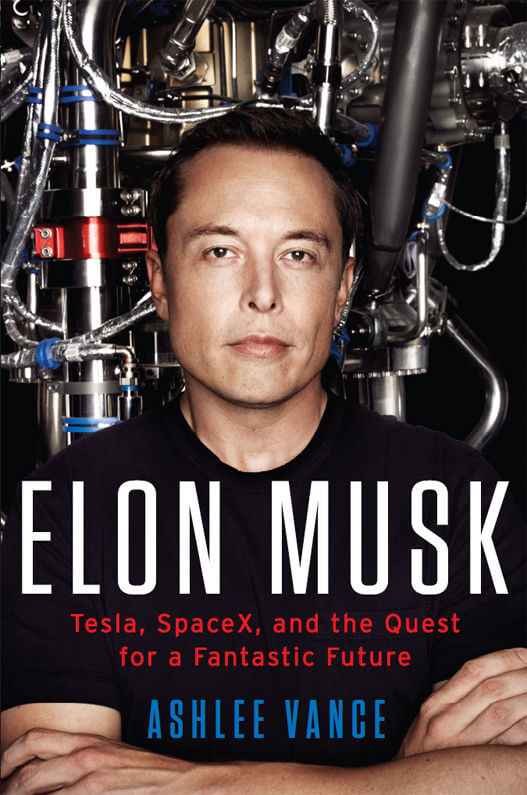

ELON MUSK
---

Tesla, SpaceX, and the Quest for a Fantastic Future

### COVER

 

  

 

  Author @[ASHLEE VANCE](https://en.wikipedia.org/wiki/Ashlee_Vance)

### CONTENTS

- [ELON'S WORLD](https://github.com/johnnynode/Elon-Musk/blob/master/CONTENTS/1.ELON'S%20WORLD.md)

- [AFRICA](https://github.com/johnnynode/Elon-Musk/blob/master/CONTENTS/2.AFRICA.md)

- [CANADA](https://github.com/johnnynode/Elon-Musk/blob/master/CONTENTS/3.CANADA.md)

- [ELON'S FIRST START-UP](https://github.com/johnnynode/Elon-Musk/blob/master/CONTENTS/4.ELON'S%20FIRST%20START-UP.md)

- [PAYPAL MAFIA BOSS](https://github.com/johnnynode/Elon-Musk/blob/master/CONTENTS/5.PAYPAL%20MAFIA%20BOSS.md)

- [MICE IN SPACE](https://github.com/johnnynode/Elon-Musk/blob/master/CONTENTS/6.MICE%20IN%20SPAC.md)

- [ALL ELECTRIC](https://github.com/johnnynode/Elon-Musk/blob/master/CONTENTS/7.ALL%20ELECTRIC.md)

- PAIN, SUFFERING, AND SURVIVAL

- LIFTOFF

- THE REVENGE OF THE ELECTRIC CAR

- THE UNIFIED FIELD THEORY OF ELON MUSK EPILOGUE